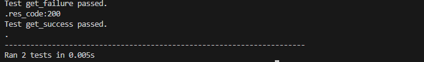
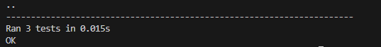

# 软件体系架构
[toc]
## 背景
GitHub 上有很多优秀的关于天气预测的 Repository ，但都是基于本地化和网络爬虫进行的，所以我创建了这个Repository。我们的项目基于机器学习的随机森林模型对天气进行预测，并且通过Streamlit Cloud 部署到服务器端。


如果你对我的网站感兴趣，欢迎访问我的线上网站[🌦️Weather Now](https://weathernowpublic.streamlit.app/) 来开始。


## ✨ 功能
* **实时天气查询**：获取全球各城市的当前天气。
* **机器学习预测**：使用随机森林算法训练模型并拟合数据
* **天气详细信息**：显示温度、湿度、气压、风速等。
* **简洁易用**：友好的用户界面和交互体验。

## ⌨️ 技术栈
* **前端**：HTML, CSS, JavaScript
* **后端**：Python
* **API**：Streamlit API 

## 项目规范
### 项目结构
我们遵循了 Github 项目：[pythonic-project-guidelines](https://github.com/pyloong/pythonic-project-guidelines)的规范要求，对项目文件结构构成如下：
> * db
> * docs
> * src
>   * lib
>       * \_\_init__.py
> * tests
>  * README\.md

### 提交规范

我们参考了 AngularJS 在 github 上的[提交记录](https://www.npmjs.com/package/commitizen)
采用格式：         

> type(scope) : subject

( 1 ) type（必须） : commit 的类别，只允许使用下面几个标识：

feat : 新功能  
fix : 修复bug    
docs : 文档改变  
style : 代码格式改变   
refactor : 某个已有功能重构  
perf : 性能优化  
test : 增加测试  
build : 改变了build工具 如 grunt换成了 npm  
revert : 撤销上一次的 commit  
chore : 构建过程或辅助工具的变动  
( 2 ) scope（可选） : 用于说明 commit 影响的范围，比如数据层、控制层、视图层等等，视项目不同而不同。    
( 3 ) subject（必须） : commit 的简短描述，不超过50个字符。commitizen 是一个撰写合格 Commit message 的工具，遵循 Angular 的提交规范。  

## 工作量化

### 代码提交
由于软件开发是从数据获取开始进行的，即从网络上获取天气数据，并进行数据清洗和预处理。因此我们在项目进行的第一周代码提交量较少。
在搭建完基础的核心部分，即**数据访问层**和**服务层**之后，我们进行了**表示层**和**应用层**的开发，我们的这里我们先进行了本地部署，在进行了可视化的部署，因此代码提交行数较高。


从commit提交来看，我们总共提交了28次commit。


### 项目开发

我们的开发最开始是通过开发日志的形式进行，后续改为issue。
贴图


截止2024.12.10，我们已经迭代了四个版本，并且发布在releses中，我们的版本有
贴图，版本更新图


## 🛠️ 依赖

如果你尝试本地部署本项目，请确保你正确安装了以下这些模块，以下是两种依赖安装的例程，他将指导你如何正确配置依赖。
1. 我们提供了配置依赖的工具[ Require.exe ](/Require.exe)，你可以**避免所有的命令行操作**，只需要运行此工具即可。

2. 如果你使用的并非`windos`系统或者基于其他理由希望使用命令行。
   你可以通过**依赖管理工具**，例如`pip`来安装这些模块。以下是使用`pip`进行依赖配置的例程。你可以在命令行中输入如下命令：
    >[!TIP]
    >在此之前，请确保你的`pip`处于最新版本
    >你可以通过如下命令对`pip`更新
    >```cmd
    >pip install --upgrade pip
    >```
    ```
    pip install moudelname
    ```

* [numpy](https://pypi.org/project/numpy/)
* [streamlit](https://pypi.org/project/streamlit/)
* [pandas](https://pypi.org/project/pandas/)
* [scikit_learn](https://pypi.org/project/scikit_learn/)

_转到 [requirements.txt](/requirements.txt) 查看所有你所应安装的模块_


## 一键部署
我们的项目非常易于部署，使用EXE


## 架构
本项目大体上采用了分层系统风格架构。
总体分为**表示层**，**应用层**，**服务层**，**数据访问层**。
层与层之前不能直接进行互通，非相邻分层之间不可以进行数据互通，只可以进行迭代访问。
### 层的划分
```
表示层： 负责处理用户界面和用户交互。例如，网页或移动应用的前端界面。
应用层： 包含系统的业务逻辑，处理用户请求并执行相关的操作。
服务层： 提供应用层所需的特定服务，如认证或数据转换服务。
数据访问层： 负责与数据库或其他持久性存储进行交互。
```


#### 数据访问层
构成数据访问层的主要类为`GetData`。通过获取数据使得整个程序得以运转和训练。
* **GetData**：通过使用requests库的方法`requests.get(url,params,**kwargs)`对url进行数据的获取，并且进行网页数据的decode。
向上对服务层提供`url`和`headers`的接口
#### 服务层
构成服务层的主要类为`Data2CSV`和`TrainDataProcess`。通过对获取的数据进行数据清洗和CSV持久化保存，之后通过对CSV文件的分割处理为训练集和验证集
* **Data2CSV**：
  * `remove_units(data)`: 清理数据，去除非数字字符，并为缺失数据填充占位符。
  * `url_process(years, days)`: 构建用于获取天气数据的URL，基于输入的年份和天数差值计算日期范围。
  * `data2csv(years, days, filename)`:从生成的URL下载天气数据，使用XPath提取相关数据，清理并格式化后，写入到一个CSV文件中
* **TrainDataProcess**
  * `ProcessData(city_idx)`:实现数据预处理，包括清洗和分割。
服务层通过调用数据层获取数据，并且向上提供`years`、 `days` 、`city_idx` 接口
#### 应用层
构成应用层的主要类为`Model`和`Socket`。他的实现主要来自于表示层的调用，当表示层有包括但不限于更改查询城市的事件请求时，附加传入的参数对模型进行训练,并本地化为PKL文件减少网站压力。
* **Model**：
  * `GetModel(city_idx, filename="Model.pkl")`：实现模型训练、评估和保存。
* **socket**：
  * `find(city_name)`:传入的城市名称，用于在 city.csv 文件中查找。
应用层通过上层传入的参数进行模型训练，向上对表示层提供`city_name `的接口
#### 表示层
表示层主要通过网站与用户进行可视化的交互，可视化的主要实现类为`VISUALIZATION`。通过用户在可视化控件进行不同的输入，将其作为参数调用下一层的服务进行反馈并保证用户交互过程中的稳定性。


  
## 测试
总体的测试我们整体分为三个部分，分别是对于网站的在线测试，对于训练模型的评估，和对于内部数据模块的单元测试。


### 单元测试
我们使用python中的unittest库来进行单元测试，对项目中的核心类和函数及进行测试。
#### GetData类
我们使用`test_GetData.py`进行类的测试。这个测试文件包含了对`GetData`类的各种方法的单元测试，确保数据获取功能的正确性和稳定性。通过模拟不同的网络环境和数据输入，我们验证了`GetData`类在各种情况下的表现，确保其能够可靠地获取和处理天气数据。

测试功能：Get类在HTTP请求失败和成功情况下的响应
测试版本：1.0
测试环境：Python 3.11.3 
unittest 
测试版本：version-1.0
测试输入：在搜索框中输入“长”
测试预期输出：搜索框中输出以“长”含有的中国城市
```python
class TestGetData(unittest.TestCase):

    @patch('requests.get')
    def test_get_success(self, mock_get):
        # Arrange
        url = "http://example.com"
        expected_content = "Example content"
        mock_response = Mock()
        mock_response.status_code = 200
        mock_response.content.decode.return_value = expected_content
        mock_get.return_value = mock_response

        get_data = GetData(url)

        # Act
        result = get_data.Get()

        # Assert
        self.assertEqual(result, expected_content)
        mock_get.assert_called_once_with(url=url, headers=get_data.headers)
        print("Test get_success passed.")

    @patch('requests.get')
    def test_get_failure(self, mock_get):
        # Arrange
        url = "http://example.com"
        mock_response = Mock()
        mock_response.status_code = 404
        mock_response.content.decode.return_value = "Not Found"
        mock_get.return_value = mock_response

        get_data = GetData(url)

        # Act
        result = get_data.Get()

        # Assert
        self.assertEqual(result, "Not Found")
        mock_get.assert_called_once_with(url=url, headers=get_data.headers)
        print("Test get_failure passed.")

if __name__ == '__main__':
    unittest.main()
```
预期输出：测试完成后抛出SystemExit异常，终端显示测试通过
测试输出：



#### Data2CSV类

测试功能：测试Data2CSV在处理数据的健壮性、
测试版本：1.0
测试环境：Python 3.11.3
unittest
测试版本：version-1.0
测试输入：虚拟的训练数据、验证数据和测试数据
测试预期输出：测试完成后抛出SystemExit异常，终端显示测试通过

```python
import unittest
from unittest.mock import patch, MagicMock
from datetime import datetime, timedelta
from Data2CSV import remove_units, url_process, data2csv

class TestData2CSV(unittest.TestCase):

    def test_remove_units(self):
        data = ["10mm", "20%", "-", "Tr", "30.5C"]
        expected = ["10", "20", "3", "2", "30.5"]
        result = remove_units(data)
        self.assertEqual(result, expected)

    @patch('Data2CSV.datetime')
    def test_url_process(self, mock_datetime):
        mock_datetime.today.return_value = datetime(2024, 11, 14)
        years = [1, 0]
        days = [10, 5]
        expected_url = ("http://www.meteomanz.com/sy2?l=1&cou=2250&ind=57687&d1=04&m1=11&y1=2023&d2=19&m2=11&y2=2024")
        result = url_process(years, days)
        self.assertEqual(result, expected_url)

    @patch('Data2CSV.GetData')
    @patch('Data2CSV.etree.HTML')
    @patch('builtins.open', new_callable=unittest.mock.mock_open)
    def test_data2csv(self, mock_open, mock_etree, mock_getdata):
        mock_getdata.return_value.Get.return_value = '<html><body><td>10mm</td><td>20%</td><td>-</td><td>Tr</td><td>30.5C</td><td>10mm</td><td>20%</td><td>-</td><td>Tr</td><td>30.5C</td></body></html>'
        mock_etree.return_value.xpath.return_value = [MagicMock(text='10mm'), MagicMock(text='20%'), MagicMock(text='-'), MagicMock(text='Tr'), MagicMock(text='30.5C'), MagicMock(text='10mm'), MagicMock(text='20%'), MagicMock(text='-'), MagicMock(text='Tr'), MagicMock(text='30.5C')]
        years = [1, 0]
        days = [10, 5]
        filename = "test.csv"
        data2csv(years, days, filename)
        mock_open.assert_called_once_with("db/test.csv", 'w', newline='')
        handle = mock_open()
        handle.write.assert_called()
        handle.writelines.assert_called()

if __name__ == '__main__':
    unittest.main()
```
测试输出：

### 网站测试
我们按照网站测试的一般流程，分步骤对网站进行了UI测试、链接测试、搜索测试、网站响应
#### UI测试
UI测试我们统一使用浏览器开发者工具进行网页测试，主要测试在不同分辨率下，我们网站UI的表现情况和稳定性。具体有以下指标：
* 各页面的风格是否统一
* 各页面的大小是否一致；同样的LOGO图片在各个页面中显示是否大小一致；
* 页面及图片是否居中显示 、各页面的title是否正确。
* 栏目名称、文章内容等处的文字是否正确，有错别字或乱码；
* 同一级别的字体、大小、颜色是否统一
#### 网页测试


#### 链接测试
* 页面是否有无法连接的内容；图片是否能正常显示，有无冗余图片，代码是否规范
* 页面点击LOGO下的一级栏目或二级栏目名称，是否可进入相应的栏目

#### 搜索测试
##### 搜索补全
测试功能：搜索是否能够实现正常补全
测试环境：Microsoft Edge 版本 131.0.2903.86 (正式版本) (64 位)
测试版本：version-1.1
测试输入：在搜索框中输入“长”
测试预期输出：搜索框中输出以“长”含有的中国城市


##### 搜索快捷键
测试功能：搜索框对于键盘`TAB`，`Enter`，`Up`，`Down`的支持
测试环境：Microsoft Edge 版本 131.0.2903.86 (正式版本) (64 位)
测试版本：version-1.1
测试输入：在搜索框中输入“长”后进行键盘快捷键操作选取“长春市”
测试预期输出：搜索框正常选择“长春市”，并且页面刷新关于“长春市的天气”


#####  默认查询字段
测试功能：搜索框的默认输入选项
测试环境：Microsoft Edge 版本 131.0.2903.86 (正式版本) (64 位)
测试版本：version-1.1
测试输入：无
测试预期输出：搜索框默认选择“长沙市”，并且页面显示关于“长沙市”的天气
    

#### 网站响应
##### 响应时间
测试功能：对网站的响应时间使用python的`request`库进行测试
测试环境：Python 3.11.3
测试版本：version-1.2
测试输入：无
测试预期输出：终端输出每次请求的响应时间
```python
import requests
import time
import matplotlib.pyplot as plt
from pylab import mpl
mpl.rcParams['font.sans-serif'] = ['Microsoft YaHei'] # 指定默认字体：解决plot不能显示中文问题
mpl.rcParams['axes.unicode_minus'] = False # 解决保存图像是负号'-'显示为方块的问题

# 网站 URL

url="https://weathernow-android.streamlit.app/"
# 测试配置
num_requests = 20  # 请求次数
interval = 1       # 每次请求间隔时间（秒）

# 存储响应时间数据
response_times = []

print(f"开始测试 {url} 的响应时间...")
for i in range(num_requests):
    try:
        start_time = time.time()
        response = requests.get(url, timeout=10)  # 设置超时时间为 10 秒
        end_time = time.time()
        
        # 计算响应时间
        response_time = (end_time - start_time) * 1000  # 转为毫秒
        response_times.append(response_time)
        
        print(f"请求 {i + 1}: 响应时间 = {response_time:.2f} ms, 状态码 = {response.status_code}")
        
        # 如果需要检查是否正常访问，可以添加断言
        assert response.status_code == 200, "状态码异常"
    except Exception as e:
        print(f"请求 {i + 1} 失败: {e}")
        response_times.append(None)  # 记录失败的请求为 None
    time.sleep(interval)

# 数据处理（移除失败的请求数据）
valid_times = [t for t in response_times if t is not None]

# 可视化响应时间
plt.figure(figsize=(10, 6))
plt.plot(range(1, len(response_times) + 1), response_times, marker='o', label="响应时间 (ms)")
plt.axhline(y=sum(valid_times) / len(valid_times), color='r', linestyle='--', label="平均响应时间")

# 图表设置
plt.title(f"网站响应时间测试 ({url})")
plt.xlabel("请求次数")
plt.ylabel("响应时间 (ms)")
plt.xticks(range(1, len(response_times) + 1))
plt.legend()
plt.grid()

# 显示图表
plt.show()

```
测试输出：平均响应时长2654.37ms


#### 综合评价

我们使用了较为成熟的网站响应测试工具[Gtmetrix](https://gtmetrix.com/)进行了响应测试
这个工具根据网站速度打分A-F，结合Yslow和PageSpeedInsights的数据，提供网站表现报告帮助用户分析网站问题并优化。

* **GTmetrix Grade**：你的 GTmetrix 等级是对你的整体页面性能的评估。它既反映了您的页面为用户加载的速度，也反映了它的性能。
* **Structure**：您的结构得分是我们对 Lighthouse 和自定义 GTmetrix 审核的专有评估。它代表了您的页面是否能达到最佳性能。
* **Web Vitals**： Web Vitals 代表了一小部分核心指标，它们表明您是否为访客提供了快速和（Google 所称的）愉悦的体验。在进行更深层次的优化之前，首先关注这些有影响力的指标
* **CLS**：CLS 表示页面加载时访问者体验到的布局变化程度。要获得良好的用户体验，CLS 分数应在 0.1 或以下。
  
### 模型评估

我们对于模型的拟合程度从**MAE**（平均绝对误差）的角度进行分析，这是一种衡量预测值与实际值之间差异的常用指标。

除此以外，因为在线网站的特性，我们同时需要关注模型的**训练耗时**，即模型在接收到输入数据后生成预测结果所需的时间。
这两个指标共同决定了模型在实际应用中的表现，既要保证预测的准确性，又要确保用户体验的流畅性。

*以下测试均在测试数据已**略去**从远程服务器中获取训练信息的响应时长。*

#### MAE
平均绝对误差（MAE，Mean Absolute Error）是衡量预测模型或估计方法准确度的指标之一。它反映了预测值与真实值之间的绝对误差的平均水平。MAE 的计算公式如下：
```
MAE = (1/n) * Σ|yi - xi|
```
在机器学习的过程中，模型的参数至关重要。
```python
n_estimators=500,  # 增加树的数量以提高性能
max_features='auto',  # 寻找最佳分割时要考虑的特征数量
bootstrap=True,  # 构建树时是否使用自助样本
n_jobs=-1  # 使用所有可用的核心进行并行处理
```
其中最主要的参数便是`n_estimators`,他直接影响了系统进行模型训练时的质量和时长。考虑到在线网站的响应速度的要求特性，我们需要兼顾训练质量和响应时长二者的平衡。
常用的参数调优方法有**贝叶斯调优**，**网格搜索**等。


#### 训练耗时
在使用 time 库对机器学习模型训练的耗时进行测量时，可以通过记录训练开始和结束时的时间点，并计算它们之间的时间差，来精确评估模型训练所需的时间。这种方法能够帮助开发者了解模型的训练效率，从而优化代码性能或选择更高效的算法与硬件配置。


#### 测试用例
因为测试相对简单一次耗时相对较大，且返回值为列表形式。我们并没有使用装饰器进行测试，而是在test中新增了测试脚本[test_model.py](test_model.py)进行测试，不过这也使得我们的返回值更易被处理和可视化。

测试功能：对模型的MAE和训练耗时进行测试。
测试环境：Python 3.11.3
测试时间：2024.12.10
测试版本：version-1.2
测试输入：`np.linspace(50, 1000, 50, dtype=int)`
测试预期输出：`figure`中显示`n_estimators`与`MAE`、`Training Time`趋势
```python

import joblib
import datetime as DT
from src.lib.GetModel import GetModel
import matplotlib.pyplot as plt
import time
import numpy as np

# 定义n_estimators的范围
n_estimators_range = np.linspace(50, 200, 50, dtype=int)
mae_list = []
time_list = []

for n in n_estimators_range:
    #没有使用装饰器
    #此处需要更改GetModel函数进行测试
    r,training_time = GetModel(n_estimators=n)
    mae = r[0]
    mae_list.append(mae)
    time_list.append(training_time)
    
    print(f"n_estimators: {n}, MAE: {mae}, Training Time: {training_time} seconds")

# 可视化MAE与n_estimators的关系
plt.figure(figsize=(14, 7))

plt.subplot(1, 2, 1)
plt.plot(n_estimators_range, mae_list, marker='o', linestyle='-', color='b', label='MAE')
plt.title('MAE vs n_estimators')
plt.xlabel('n_estimators')
plt.ylabel('MAE')
plt.grid(True)
plt.legend()

plt.subplot(1, 2, 2)
plt.plot(n_estimators_range, time_list, marker='o', linestyle='-', color='r', label='Training Time')
plt.title('Training Time vs n_estimators')
plt.xlabel('n_estimators')
plt.ylabel('Training Time (seconds)')
plt.grid(True)
plt.legend()

plt.tight_layout()
plt.show()

# 读取保存的模型
model = joblib.load('Model.pkl')

# 最终预测结果
preds = model.predict(r[1])
```
测试输出：


测试功能：对模型的MAE和训练耗时进行测试。
测试环境：Python 3.11.3
测试版本：version-1.2
测试时间：2024.12.10
测试输入：`np.linspace(50, 200, 50, dtype=int)`,`长沙市`
测试预期输出：`figure`中显示`n_estimators`与`MAE`、`Training Time`趋势
```python

import joblib
import datetime as DT
from src.lib.GetModel import GetModel
import matplotlib.pyplot as plt
import time
import numpy as np

# 定义n_estimators的范围
n_estimators_range = np.linspace(50, 200, 50, dtype=int)
mae_list = []
time_list = []

for n in n_estimators_range:
    #没有使用装饰器
    #此处需要更改GetModel函数进行测试
    r,training_time = GetModel(n_estimators=n)
    mae = r[0]
    mae_list.append(mae)
    time_list.append(training_time)
    
    print(f"n_estimators: {n}, MAE: {mae}, Training Time: {training_time} seconds")

# 可视化MAE与n_estimators的关系
plt.figure(figsize=(14, 7))

plt.subplot(1, 2, 1)
plt.plot(n_estimators_range, mae_list, marker='o', linestyle='-', color='b', label='MAE')
plt.title('MAE vs n_estimators')
plt.xlabel('n_estimators')
plt.ylabel('MAE')
plt.grid(True)
plt.legend()

plt.subplot(1, 2, 2)
plt.plot(n_estimators_range, time_list, marker='o', linestyle='-', color='r', label='Training Time')
plt.title('Training Time vs n_estimators')
plt.xlabel('n_estimators')
plt.ylabel('Training Time (seconds)')
plt.grid(True)
plt.legend()

plt.tight_layout()
plt.show()

# 读取保存的模型
model = joblib.load('Model.pkl')

# 最终预测结果
preds = model.predict(r[1])
```
测试输出：


_使用网格搜索优化后，我们设置`n_estimators`为80（2024.12.10）_
_在大多数环境的综合训练耗时大致在0.1272s（2024.12.10）_
_使用网格搜索优化后，MAE=11.2（2024.12.10）_

## 预期成果

- [x] 添加更新日志
- [x] 使用 Radom Frost 进行模型训练
- [x] 使用Streamlit进行数据可视化
- [X] 使用Streamlit Cloud进行服务器部署
- [x] 进一步优化可视化界面
    - [x] 增加侧边栏控件
    - [x] 增加开屏动画
    - [ ] 增加多种数据展示图样
- [x] 优化模型超参数
- [ ] 优化网站响应速度  
    - [x] 调优`n_estimators`参数减少训练时长
    - [ ] 本地储存训练数据减少网络延迟


## 致谢

此项目的可视化模板和对streamlit部署环境处理主要灵感来源于作者`JuneWaySue`  
此项目的可视化界面的大部分组件主要来源于[Streamlit Gallery](https://streamlit.io/gallery)，感谢为开源做出贡献的作者。
* [GW Quickview](https://gw-quickview.streamlit.app/)
* [30Day of Streamlit](https://30days.streamlit.app/)
* [JuneWaySue](https://github.com/JuneWaySue)
* [Streamlit中文文档](https://www.streamlit.org.cn/)
